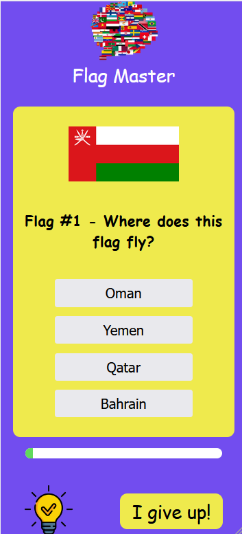
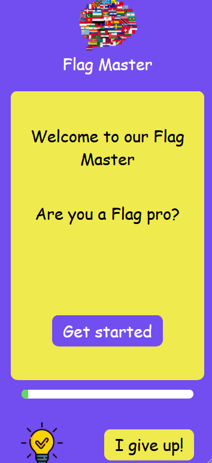

Voici une version corrigée et fluide de ton texte :

Mon premier projet à la Wild Code School

Le but de ce projet était de créer une interface avec des fonctionnalités en JavaScript.

Notre équipe a choisi de réaliser un quiz sur les drapeaux.

Dans notre application, il y a un total de 10 questions. Pour chaque question, 4 réponses sont proposées. Si la réponse choisie est correcte, elle devient verte ; sinon, elle devient rouge, et la bonne réponse s'affiche également en vert en même temps.

Vous trouverez aussi un bouton "I give up", qui vous ramène directement à la page d'accueil.

À la fin du quiz, l'application affiche votre résultat, indiquant combien de questions vous avez bien répondues. Un bouton 'Restart' est également disponible pour recommencer.